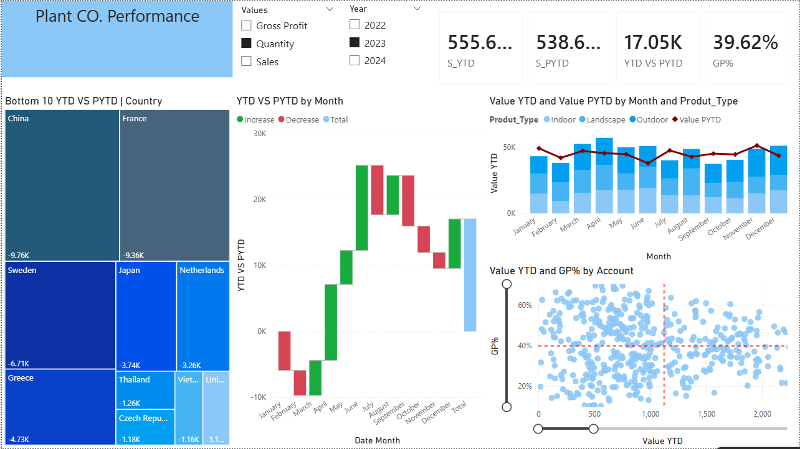

# 📊Plant CO. Performance Dashboard | Power BI

##📌 Overview
This project is an interactive **Power BI dashboard** designed to analyze and monitor plant commercial performance across countries, months, accounts, and product types.

The report provides a dynamic comparison between **Year-to-Date (YTD)** and **Previous Year-to-Date (PYTD)** performance, helping users evaluate trends, identify underperforming areas, and assess profitability through interactive filtering and metric switching.

## Project Objectives
The main goals of this project were to:

- import and transform raw data using Power Query
- create reusable DAX measures and switch logic
- design dynamic and interactive visualizations
- enable flexible analysis through slicers and metric selection
- present business performance in a clear and decision-oriented dashboard

## Tools & Technologies
- **Power BI**
- **Power Query**
- **DAX**
- **Excel dataset**

##📂  Dataset
The dashboard was built using the `Plant_DTS.xls` dataset.

## Workflow

###⚙️ 1. Data Upload & Transformation
The dataset was imported into Power BI and transformed using **Power Query**.  
This stage included cleaning, formatting, and preparing the data for efficient analysis and visualization.

###📈  2. Measures & Switch Logic
A dedicated table was created to store **DAX measures** and **switches** used for dynamic reporting.

This logic made it possible to:
- calculate **YTD**
- calculate **PYTD**
- calculate **YTD vs PYTD variance**
- calculate **Gross Profit Percentage (GP%)**
- dynamically switch between **Gross Profit**, **Sales**, and **Quantity**

###📊 3. Dashboard Formatting & Dynamic Visualizations
The report was formatted into an interactive dashboard with the following visuals:

- **KPI Cards**
- **Treemap**
- **Waterfall Chart**
- **Scatter Chart**
- **Stacked Line and Column Chart**
- **Slicers for Year and Metric Selection**

##  Dashboard Features

### Interactive Slicers
The dashboard includes two main slicers that enhance user interaction:

- **Year slicer**: allows filtering the report by **2022, 2023, and 2024**
- **Metric slicer**: allows switching dynamically between **Gross Profit, Sales, and Quantity**

These slicers make the dashboard more flexible and allow users to explore performance from different business perspectives.

### KPI Cards
The top section of the dashboard displays high-level KPIs, such as:
- **YTD Value**
- **PYTD Value**
- **YTD vs PYTD**
- **GP%**

### Treemap
The treemap visual highlights the **Bottom 10 countries** based on **YTD vs PYTD** performance.

### Waterfall Chart
The waterfall chart shows how each month contributes positively or negatively to the overall **YTD vs PYTD** result.

### Stacked Line and Column Chart
This visual compares **Value YTD by Product Type** across months and overlays **Value PYTD** as a trend line for comparison.

### Scatter Chart
The scatter plot analyzes the relationship between:
- **Value YTD**
- **GP%**
across different accounts.

##📸 Performance Report

## Business Value
This dashboard helps users to:

- compare current performance with previous-year results
- monitor trends over time
- identify underperforming countries
- analyze account-level profitability
- switch between key business metrics instantly
- filter insights by year for more focused analysis
---

## 👤 Author
Anastasios Saliaris
